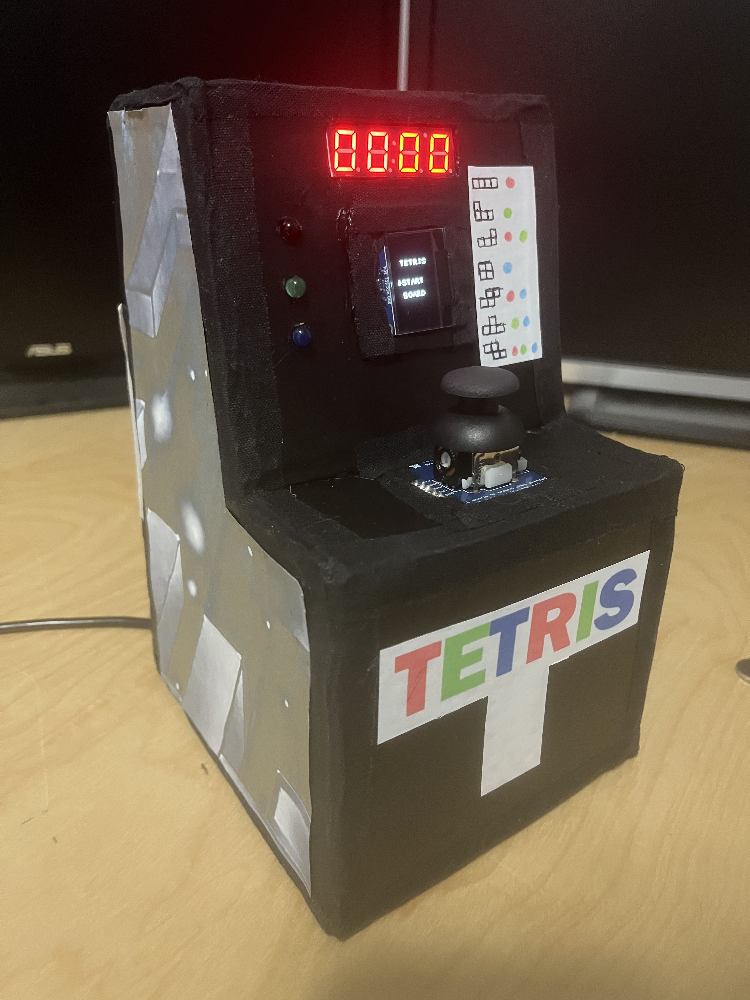
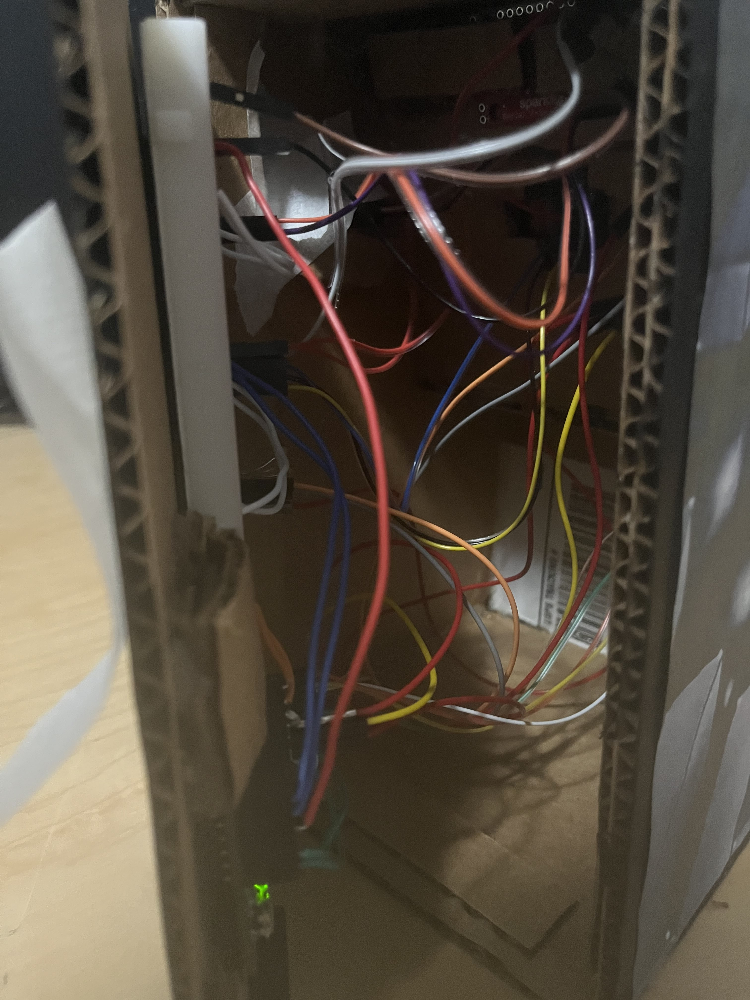
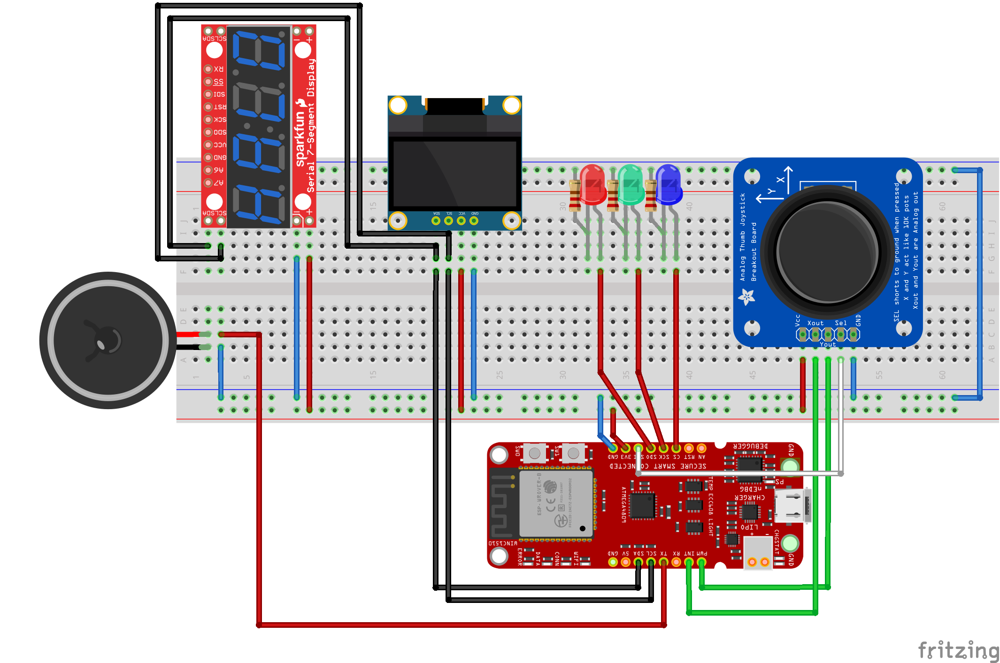

# Minetris

  
  &nbsp; &nbsp; &nbsp; &nbsp;
  

## Concept

 Ever wondered how difficult it would be to build an arcade machine? I pondered the same, to the extent that I decided that I would build my own arcade machine where you could play the game <a href="https://en.wikipedia.org/wiki/Tetris">Tetris</a> on. I chose Tetris since it is a game commonly found in many arcades, and it's a classic I've always enjoyed playing in my free time. My implementation of the game attempts to replicate the <a href="https://en.wikipedia.org/wiki/Tetris_(NES_video_game)">NES</a> version of Tetris, which is known as <em>Classic Tetris</em> along with a custom version I made known as <em>Cascade Tetris</em>.

Outside of the fun factor of making a video game, I felt the project brought on equal levels of difficulty on the hardware and software sides. Such as working with new peripherals, learning how to solder parts, managing my own basic graphics library, and finally building the case for it. The project also tackles an interesting problem that comes with working with microcontrollers. Which is the restriction brought on by having a limited amount of available RAM. This unique issue comes up heavily when working with displays, requiring you to be very frugal with what you can and cannot do memory-wise.

## Implementation

  

The goal of the project was to apply key aspects of embedded systems using the  AVR-BLE board with ATmega3208 microcontroller. Below is a list of how the different peripherals interact with the board:

- User control is managed by the analog thumbstick, which allows the user to input three different options. Two of these options include vertical and horizontal analog inputs, which are handled by ADC. These actions allow the user to navigate different screens within my system and provide movement of pieces when playing the game. The last option is a digital input, which is read from an interrupt ISR when the thumbstick is pressed down. This action allows the user to perform selections while in menus and rotate the falling pieces. This input is also software-side debounced to improve the user experience.

- The I²C protocol is utilized on two major peripherals within the system. The first is the 128x64 OLED display, which reads a pixel-based buffer to display different images on the screen. And the 7-segment display, which is sent over a number that represents the current score achieved by the player.

- Another set of displays that are shown to the user are three LEDs (red, green, and blue). Over digital I/O, the LEDs light up in different orders to let the user know the next piece.

- Korobeiniki (A-Type) is played while the game is running. This occurs by using the speaker with the TCA peripheral in frequency wave generation mode.

## Code Organization
<strong>Note:</strong> Immediately loading this project in MPLAB will reorganize the code present in the repository into logical folders based on `nbproject/configurations.xml`.